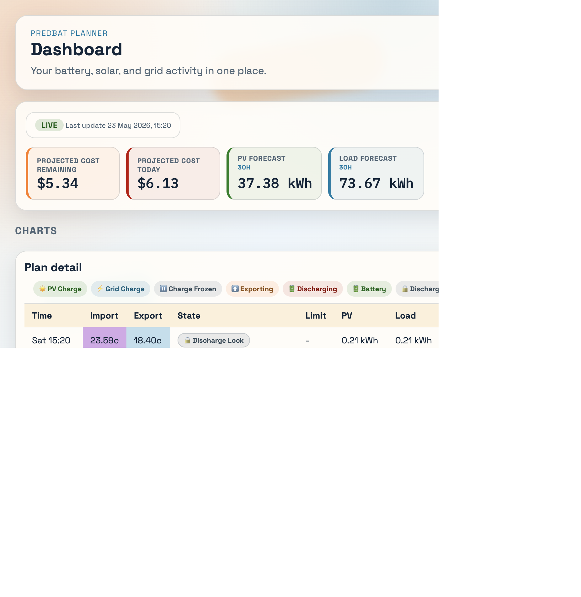

# Predbat frontend

I wasn't super happy with the UX [Predbat](https://github.com/springfall2008/batpred) presents, so I made my own. This is a Python frontend that fetches only the Predbat `/plan` page, extracts the embedded JSON datasets, and renders a cleaner dashboard UI.



## What It Includes

- Single-page dashboard for Predbat plan data
- Tabs for available datasets from the `/plan` page:
  - Plan
  - Yesterday
  - Without Predbat
- Visual charts for:
  - Battery SoC
  - PV vs Load
  - Cost delta by slot
- Detailed time-slot table with sticky headers
- Flask app compatible with Waitress

## Run Locally

```bash
python3 -m venv .venv
source .venv/bin/activate
pip install -r requirements.txt
python app.py
```

Open `http://localhost:5053/plan`.

## Run With Waitress

```bash
source .venv/bin/activate
waitress-serve --listen=0.0.0.0:5053 app:app
```

## Configuration

This project loads configuration from a `.env` file in the project root.

Copy the example template and edit it with your Predbat host:

```bash
cp .env.example .env
# edit .env and set PRED_BAT_PLAN_URL
```

Supported variables:

- `PRED_BAT_PLAN_URL` — required, URL of your Predbat `/plan` page
- `PRED_BAT_PLAN_URLS` — optional comma-separated fallback list, tried in order
- `REFRESH_INTERVAL_SECONDS` — optional, how often the frontend auto-refreshes plan data (default `180`, i.e. 3 minutes)
- `GOOGLE_CLIENT_ID`, `GOOGLE_CLIENT_SECRET` — Google OAuth credentials (see below)
- `OAUTH_REDIRECT_BASE_URL` — public base URL of the app (e.g. `https://predbat.example.com`)
- `ALLOWED_EMAILS` — comma-separated allowlist of Google account emails permitted to sign in
- `SECRET_KEY` — random string used to sign session cookies (generate with `python -c "import secrets; print(secrets.token_hex(32))"`)
- `DEV_BYPASS_AUTH` — local development only; when `true`, skips Google OAuth but **only** if the request comes from `127.0.0.1`/`::1`. Never enable on a public deployment.
- `DEV_USER_EMAIL` — optional email shown for the bypass dev user (default `dev@localhost`).

The `.env` file is gitignored.

## Google OAuth Setup

The `/plan` page and `/api/plan-data` endpoint require an authenticated Google
user whose email is in `ALLOWED_EMAILS`.

1. Open [Google Cloud Console → Credentials](https://console.cloud.google.com/apis/credentials).
2. Create an **OAuth 2.0 Client ID** (Application type: *Web application*).
3. Add an **Authorized redirect URI**: `<OAUTH_REDIRECT_BASE_URL>/auth/callback`
   (e.g. `https://predbat.example.com/auth/callback`).
4. Copy the **Client ID** and **Client secret** into `.env`.
5. Set `OAUTH_REDIRECT_BASE_URL` to the exact public URL of your deployment.
6. Set `ALLOWED_EMAILS` to a comma-separated list of emails permitted to log in.
7. Generate and set `SECRET_KEY`.
8. Restart the service.

Auth flow:

- Unauthenticated requests to `/plan` are redirected to `/auth/login`.
- Unauthenticated requests to `/api/plan-data` get `401 unauthorized`.
- `/auth/logout` clears the session.


## Run With Docker

A `Dockerfile` and `docker-compose.yml` are included for containerised
deployments.

```bash
cp .env.example .env
# edit .env (PRED_BAT_PLAN_URL, Google OAuth creds, etc.)
docker compose up -d
```

The app listens on port `5053`. Open `http://localhost:5053/plan`.

Notes:
- If your Predbat instance runs on the **same host** (outside Docker), set
  `PRED_BAT_PLAN_URL=http://host.docker.internal:5052/plan` in `.env`. The
  compose file already adds the `host.docker.internal` mapping needed on
  Linux hosts.
- If your Predbat instance is in **another container**, point
  `PRED_BAT_PLAN_URL` at that container's network alias (e.g.
  `http://predbat:5052/plan`) and put both services on the same Docker
  network.

Common commands:

```bash
docker compose logs -f predbat-frontend
docker compose restart predbat-frontend
docker compose pull && docker compose up -d   # if using a published image
```


## Run As A Systemd Service (Ubuntu)

The repo includes a templated unit file and installer script that deploy the
app to `/opt/predbat-frontend` and run it under your user account.

```bash
sudo ./scripts/install-service.sh           # installs as predbat-frontend@$USER
# or specify a different user:
sudo ./scripts/install-service.sh myuser
```

The installer will:

1. Copy the source tree to `/opt/predbat-frontend`.
2. Create `.env` from `.env.example` if not already present (edit before starting!).
3. Create a Python virtual environment and install requirements.
4. Install the systemd unit at `/etc/systemd/system/predbat-frontend@.service`.
5. Enable and start `predbat-frontend@<user>.service`.

Useful commands:

```bash
systemctl status predbat-frontend@$USER.service
journalctl -u predbat-frontend@$USER.service -f
sudo systemctl restart predbat-frontend@$USER.service
```

To uninstall:

```bash
sudo ./scripts/uninstall-service.sh
```

The default port is `5053`. To change it, edit the `ExecStart` line in
`/etc/systemd/system/predbat-frontend@.service` and run
`sudo systemctl daemon-reload && sudo systemctl restart predbat-frontend@$USER.service`.
